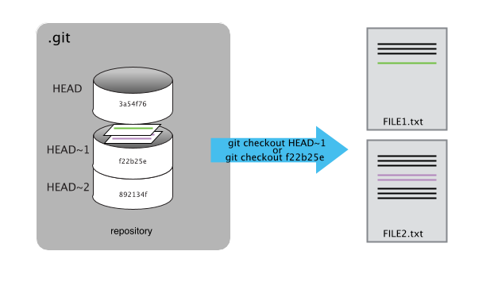
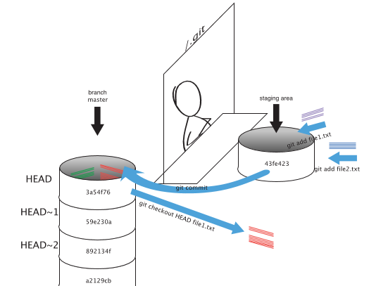

As we saw in the previous lesson, we can refer to commits by their
identifiers.  You can refer to the _most recent commit_ of the working
directory by using the identifier `HEAD`.

We've been adding one line at a time to `project.txt`, so it's easy to track our
progress by looking, so let's do that using our `HEAD`s.  Before we start,
let's make a change to `project.txt`.

~~~
$ nano project.txt
$ cat project.txt
~~~
{: .bash}

~~~
Some initial data analysis to identify how inflammation changes over time after surgery.
Jane is a Data Scientist and Samit is a statistician. We'll need to determine
who is responsible for what in this project.
We may need to bring a third person with Python programming skills into the project.
The third team member needs to be competent in both Python and R. They
also need to be familiar with matplotlib and ggplot.
Version control skills would also be useful.
~~~
{: .output}

Now, let's see what we get.

~~~
$ git diff HEAD project.txt
~~~
{: .bash}

~~~
diff --git a/project.txt b/project.txt
index 6f77c9e..151f443 100644
--- a/project.txt
+++ b/project.txt
@@ -4,3 +4,4 @@ who is responsible for what in this project.
 We may need to bring a third person with Python programming skills into the project.
 The third team member needs to be competent in both Python and R. They
 also need to be familiar with matplotlib and ggplot
+Version control skills would also be useful.

~~~
{: .output}

which is the same as what you would get if you leave out `HEAD` (try it).  The
real goodness in all this is when you can refer to previous commits.  We do
that by adding `~1` to refer to the commit one before `HEAD`.

~~~
$ git diff HEAD~1 project.txt
~~~
{: .bash}

If we want to see the differences between older commits we can use `git diff`
again, but with the notation `HEAD~1`, `HEAD~2`, and so on, to refer to them:

~~~
$ git diff HEAD~2 project.txt
~~~
{: .bash}

~~~
diff --git a/project.txt b/project.txt
index 2485f1d..151f443 100644
--- a/project.txt
+++ b/project.txt
@@ -1,3 +1,7 @@
 Some initial data analysis to identify how inflammation changes over time after surgery.
 Jane is a Data Scientist and Samit is a statistician. We'll need to determine
 who is responsible for what in this project.
+We may need to bring a third person with Python programming skills into the project.
+The third team member needs to be competent in both Python and R. They
+also need to be familiar with matplotlib and ggplot
+Version control skills would also be useful.
~~~
{: .output}

We could also use `git show` which shows us what changes we made at an older commit as well as the commit message, rather than the _differences_ between a commit and our working directory that we see by using `git diff`.

~~~
$ git show HEAD~2 project.txt
~~~
{: .bash}

~~~
commit 71ed26a8f840d2929f5120327ea0accd55074070
Author: Jane Smith <jane.smith@university.ac.uk>
Date:   Wed Jan 3 10:39:19 2018 +0000

    Add note about project responsibilities

diff --git a/project.txt b/project.txt
index 17e2b79..2485f1d 100644
--- a/project.txt
+++ b/project.txt
@@ -1 +1,3 @@
 Some initial data analysis to identify how inflammation changes over time after surgery.
+Jane is a Data Scientist and Samit is a statistician. We'll need to determine
+who is responsible for what in this project.
~~~
{: .output}

In this way,
we can build up a chain of commits.
The most recent end of the chain is referred to as `HEAD`;
we can refer to previous commits using the `~` notation,
so `HEAD~1` (pronounced "head minus one")
means "the previous commit",
while `HEAD~123` goes back 123 commits from where we are now.

We can also refer to commits using
those long strings of digits and letters
that `git log` displays.
These are unique IDs for the changes,
and "unique" really does mean unique:
every change to any set of files on any computer
has a unique 40-character identifier.
Our first commit was given the ID
`40b8a9400329ed7324116cc9392dc8e4842d8501`,
so let's try this:

~~~
$ git diff 40b8a9400329ed7324116cc9392dc8e4842d8501 project.txt
~~~
{: .bash}

~~~
diff --git a/project.txt b/project.txt
index 17e2b79..151f443 100644
--- a/project.txt
+++ b/project.txt
@@ -1 +1,7 @@
 Some initial data analysis to identify how inflammation changes over time after surgery.
+Jane is a Data Scientist and Samit is a statistician. We'll need to determine
+who is responsible for what in this project.
+We may need to bring a third person with Python programming skills into the project.
+The third team member needs to be competent in both Python and R. They
+also need to be familiar with matplotlib and ggplot
+Version control skills would also be useful.

~~~
{: .output}

That's the right answer; all the changes we made since the first commit.
Typing out random 40-character strings is annoying,
so Git lets us use just the first few characters:

~~~
$ git diff 40b8a9 project.txt
~~~
{: .bash}

~~~
diff --git a/project.txt b/project.txt
index 17e2b79..151f443 100644
--- a/project.txt
+++ b/project.txt
@@ -1 +1,7 @@
 Some initial data analysis to identify how inflammation changes over time after surgery.
+Jane is a Data Scientist and Samit is a statistician. We'll need to determine
+who is responsible for what in this project.
+We may need to bring a third person with Python programming skills into the project.
+The third team member needs to be competent in both Python and R. They
+also need to be familiar with matplotlib and ggplot
+Version control skills would also be useful.
~~~
{: .output}

So we can now save changes to files and see what we've changed; how
can we restore older versions of things?
Let's suppose we accidentally overwrite our file:

~~~
$ nano project.txt
$ cat project.txt
~~~
{: .bash}

~~~
Notes on what scripts we need to write.
~~~
{: .output}

`git status` now tells us that the file has been changed,
but those changes haven't been staged:

~~~
$ git status
~~~
{: .bash}

~~~
On branch main
Changes not staged for commit:
  (use "git add <file>..." to update what will be committed)
  (use "git checkout -- <file>..." to discard changes in working directory)

	modified:   project.txt

no changes added to commit (use "git add" and/or "git commit -a")
~~~
{: .output}

We can put things back the way they were
by using `git checkout`:

~~~
$ git checkout HEAD project.txt
$ cat project.txt
~~~
{: .bash}

~~~
Some initial data analysis to identify how inflammation changes over time after surgery.
Jane is a Data Scientist and Samit is a statistician. We'll need to determine
who is responsible for what in this project.
We may need to bring a third person with Python programming skills into the project.
The third team member needs to be competent in both Python and R. They
also need to be familiar with matplotlib and ggplot

~~~
{: .output}

As you might guess from its name,
`git checkout` checks out (i.e., restores) an old version of a file.
In this case,
we're telling Git that we want to recover the version of the file recorded in `HEAD`,
which is the last saved commit.
If we want to go back even further, say to the first commit,
we can use a commit identifier instead:

~~~
$ git checkout 40b8a9 project.txt
~~~
{: .bash}

~~~
$ cat project.txt
~~~
{: .bash}

~~~
Some initial data analysis to identify how inflammation changes over time after surgery.
~~~
{: .output}

~~~
$ git status
~~~
{: .bash}

~~~
# On branch main
Changes to be committed:
  (use "git reset HEAD <file>..." to unstage)
# Changes not staged for commit:
#   (use "git add <file>..." to update what will be committed)
#   (use "git checkout -- <file>..." to discard changes in working directory)
#
#	modified:   project.txt
#
no changes added to commit (use "git add" and/or "git commit -a")
~~~
{: .output}

Notice that the changes are on the staged area.
Again, we can put things back the way they were
by using `git checkout`:

~~~
$ git checkout HEAD project.txt
~~~
{: .bash}

> ## Don't Lose Your HEAD
>
> Above we used
>
> ~~~
> $ git checkout f22b25e project.txt
> ~~~
> {: .bash}
>
> to revert `project.txt` to its state after the commit `f22b25e`.
> If you forget `project.txt` in that command, Git will tell you that "You are in
> 'detached HEAD' state." In this state, you shouldn't make any changes.
> You can fix this by reattaching your head using ``git checkout main``
{: .callout}

It's important to remember that
we must use the commit number that identifies the state of the repository
*before* the change we're trying to undo.
A common mistake is to use the number of
the commit in which we made the change we're trying to get rid of.
In the example below, we want to retrieve the state from before the most
recent commit (`HEAD~1`), which is commit `f22b25e`:

So, to put it all together,
here's how Git works in cartoon form:

> ## Simplifying the Common Case
>
> If you read the output of `git status` carefully,
> you'll see that it includes this hint:
>
> ~~~
> (use "git checkout -- <file>..." to discard changes in working directory)
> ~~~
> {: .bash}
>
> As it says,
> `git checkout` without a version identifier restores files to the state saved in `HEAD`.
> The double dash `--` is needed to separate the names of the files being recovered
> from the command itself:
> without it,
> Git would try to use the name of the file as the commit identifier.
{: .callout}

The fact that files can be reverted one by one
tends to change the way people organize their work.
If everything is in one large document,
it's hard (but not impossible) to undo changes to the introduction
without also undoing changes made later to the conclusion.
If the introduction and conclusion are stored in separate files,
on the other hand,
moving backward and forward in time becomes much easier.

> ## Recovering Older Versions of a File
>
> Jennifer has made changes to the Python script that she has been working on for weeks, and the
> modifications she made this morning "broke" the script and it no longer runs. She has spent
> ~ 1hr trying to fix it, with no luck...
>
> Luckily, she has been keeping track of her project's versions using Git! Which commands below will
> let her recover the last committed version of her Python script called
> `data_cruncher.py`?
>
> 1. `$ git checkout HEAD`
>
> 2. `$ git checkout HEAD data_cruncher.py`
>
> 3. `$ git checkout HEAD~1 data_cruncher.py`
>
> 4. `$ git checkout <unique ID of last commit> data_cruncher.py`
>
> 5. Both 2 and 4
{: .challenge}

> ## Reverting a Commit
>
> Jennifer is collaborating on her Python script with her colleagues and
> realizes her last commit to the group repository is wrong and wants to
> undo it.  Jennifer needs to undo correctly so everyone in the group
> repository gets the correct change.  `git revert [wrong commit ID]`
> will make a new commit that undoes Jennifer's previous wrong
> commit. Therefore `git revert` is different than `git checkout [commit
> ID]` because `checkout` is for local changes not committed to the
> group repository.  Below are the right steps and explanations for
> Jennifer to use `git revert`, what is the missing command?
>
> 1. ________ # Look at the git history of the project to find the commit ID
>
> 2. Copy the ID (the first few characters of the ID, e.g. 0b1d055).
>
> 3. `git revert [commit ID]`
>
> 4. Type in the new commit message.
>
> 5. Save and close
{: .challenge}

> ## Understanding Workflow and History
>
> What is the output of `cat analysis.txt` at the end of this set of commands?
>
> ~~~
> $ cd inflammation
> $ nano analysis.txt #input the following text: We need to think about the statistical techniques to apply
> $ git add analysis.txt
> $ nano analysis.txt #add the following text: So that we have defensible conclusions
> $ git commit -m "Thoughts on statistical techniques"
> $ git checkout HEAD analysis.txt
> $ cat analysis.txt #this will print the contents of analysis.txt to the screen
> ~~~
> {: .bash}
>
> 1.
>
> ~~~
> We need to think about the statistical techniques to apply
> ~~~
> {: .output}
>
> 2.
>
> ~~~
> So that we have defensible conclusions
> ~~~
> {: .output}
>
> 3.
>
> ~~~
> We need to think about the statistical techniques to apply
> So that we have defensible conclusions
> ~~~
> {: .output}
>
> 4.
>
> ~~~
> Error because you have changed analysis.txt without committing the changes
> ~~~
> {: .output}
>
> > ## Solution
> >
> > Line by line:
> > ~~~
> > $ cd inflammation
> > ~~~
> > {: .bash}
> > Enters into the 'inflammation' directory
> >
> > ~~~
> > $ nano analysis.txt #input the following text: We need to think about the statistical techniques to apply
> > ~~~
> > {: .bash}
> > We created a new file and wrote a sentence in it, but the file is not tracked by git.  
> >
> > ~~~
> > $ git add analysis.txt
> > ~~~
> > {: .bash}
> > Now the file is staged. The changes that have been made to the file until now will be committed in the next commit.
> >
> > ~~~
> > $ nano analysis.txt #add the following text: So that we have defensible conclusions
> > ~~~
> > {: .bash}
> > The file has been modified. The new changes are not staged because we have not added the file.
> >
> > ~~~
> > $ git commit -m "Thoughts on statistical techniques"
> > ~~~
> > {: .bash}
> > The changes that were staged (We need to think about the statistical techniques to apply) have been committed. The changes that were not staged (So that we have defensible conclusions) have not. Our local working copy is different than the copy in our local repository.
> >
> > ~~~
> > $ git checkout HEAD analysis.txt
> > ~~~
> > {: .bash}
> > With checkout we discard the changes in the working directory so that our local copy is exactly the same as our HEAD, the most recent commit.
> >
> > ~~~
> > $ cat analysis.txt #this will print the contents of analysis.txt to the screen
> > ~~~
> > {: .bash}
> > If we print analysis.txt we will get answer 1.
> >
> {: .solution}
{: .challenge}

> ## Checking Understanding of git diff
>
> Consider this command: `git diff HEAD~3 project.txt`. What do you predict this command
> will do if you execute it? What happens when you do execute it? Why?
>
> Try another command, `git diff [ID] project.txt`, where [ID] is replaced with
> the unique identifier for your most recent commit. What do you think will happen,
> and what does happen?
{: .challenge}

> ## Getting Rid of Staged Changes
>
> `git checkout` can be used to restore a previous commit when unstaged changes have
> been made, but will it also work for changes that have been staged but not committed?
> Make a change to `project.txt`, add that change, and use `git checkout` to see if
> you can remove your change.
{: .challenge}

> ## Explore and Summarize Histories
>
> Exploring history is an important part of git, often it is a challenge to find
> the right commit ID, especially if the commit is from several months ago.
>
> Imagine the `inflammation` project has more than 50 files.
> You would like to find a commit with specific text in `project.txt` is modified.
> When you type `git log`, a very long list appeared,
> How can you narrow down the search?
>
> Recall that the `git diff` command allow us to explore one specific file,
> e.g. `git diff project.txt`. We can apply a similar idea here.
>
> ~~~
> $ git log project.txt
> ~~~
> {: .bash}
>
> Unfortunately some of these commit messages are very ambiguous e.g. `update files`.
> How can you search through these files?
>
> Both `git diff` and `git log` are very useful and they summarize a different part of the history for you.
> Is it possible to combine both? Let's try the following:
>
> ~~~
> $ git log --patch project.txt
> ~~~
> {: .bash}
>
> You should get a long list of output, and you should be able to see both commit messages and the difference between each commit.
>
> Question: What does the following command do?
>
> ~~~
> $ git log --patch HEAD~3 *.txt
> ~~~
> {: .bash}
{: .challenge}
