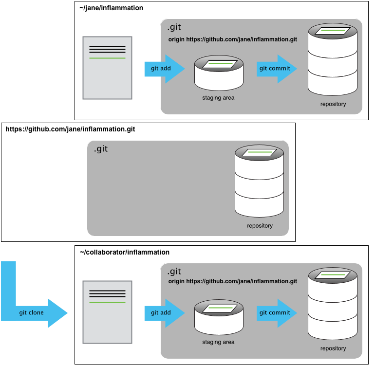

For the next step, get into pairs.  One person will be the "Owner" and the other
will be the "Collaborator". The goal is that the Collaborator add changes into
the Owner's repository. We will switch roles at the end, so both persons will
play Owner and Collaborator.

> ## Practicing By Yourself
>
> If you're working through this lesson on your own, you can carry on by opening
> a second terminal window.
> This window will represent your partner, working on another computer. You
> won't need to give anyone access on GitHub, because both 'partners' are you.
{: .callout}

The Owner needs to give the Collaborator access.
On GitHub, click the settings button on the right,
then select Collaborators, and enter your partner's username.


To accept access to the Owner's repo, the Collaborator
needs to go to [https://github.com/notifications](https://github.com/notifications).
Once there she can accept access to the Owner's repo.

Next, the Collaborator needs to download a copy of the Owner's repository to her
 machine. This is called "cloning a repo". To clone the Owner's repo into
her `Desktop` folder, the Collaborator enters:

~~~
$ git clone https://github.com/jane/inflammation.git ~/Desktop/jane-inflammation
~~~
{: .bash}

Replace `jane` with the correct username for your collaborator.



The Collaborator can now make a change in her clone of the Owner's repository,
exactly the same way as we've been doing before:

~~~
$ cd ~/Desktop/jane-inflammation
$ nano code.py
$ cat code.py
~~~
{: .bash}

~~~
# This will be a Python script
~~~
{: .output}

~~~
$ git add code.py
$ git commit -m "First Python analysis script"
~~~
{: .bash}

~~~
[main 6cc98ec] First Python analysis script
1 file changed, 2 insertions(+)
create mode 100644 code.py
~~~
{: .output}

Then push the change to the *Owner's repository* on GitHub:

~~~
$ git push origin main
~~~
{: .bash}

~~~
Counting objects: 3, done.
Delta compression using up to 4 threads.
Compressing objects: 100% (2/2), done.
Writing objects: 100% (3/3), 354 bytes | 354.00 KiB/s, done.
Total 3 (delta 0), reused 0 (delta 0)
To https://github.com/jane/inflammation.git
   9dba5e1..6cc98ec  main -> main
~~~
{: .output}

Note that we didn't have to create a remote called `origin`: Git uses this
name by default when we clone a repository.  (This is why `origin` was a
sensible choice earlier when we were setting up remotes by hand.)

Take a look to the Owner's repository on its GitHub website now (maybe you need
to refresh your browser.) You should be able to see the new commit made by the
Collaborator.

To download the Collaborator's changes from GitHub, the Owner now enters:

~~~
$ git pull origin main
~~~
{: .bash}

~~~
rremote: Counting objects: 3, done.
remote: Compressing objects: 100% (2/2), done.
remote: Total 3 (delta 0), reused 3 (delta 0), pack-reused 0
Unpacking objects: 100% (3/3), done.
From https://github.com/ARCTraining/inflammation
 * branch            main     -> FETCH_HEAD
   9dba5e1..6cc98ec  main     -> origin/main
Updating 9dba5e1..6cc98ec
Fast-forward
 code.py | 2 ++
 1 file changed, 2 insertions(+)
 create mode 100644 code.py
~~~
{: .output}

Now the three repositories (Owner's local, Collaborator's local, and Owner's on
GitHub) are back in sync.

> ## A Basic Collaborative Workflow
>
> In practice, it is good to be sure that you have an updated version of the
> repository you are collaborating on, so you should `git pull` before making
> our changes. The basic collaborative workflow would be:
>
> * update your local repo with `git pull origin main`,
> * make your changes and stage them with `git add`,
> * commit your changes with `git commit -m`, and
> * upload the changes to GitHub with `git push origin main`
>
> It is better to make many commits with smaller changes rather than
> of one commit with massive changes: small commits are easier to
> read and review.
{: .callout}

> ## Switch Roles and Repeat
>
> Switch roles and repeat the whole process.
{: .challenge}

> ## Review Changes
>
> The Owner pushed commits to the repository without giving any information
> to the Collaborator. How can the Collaborator find out what has changed with
> command line? And on GitHub?
>
> > ## Solution
> > On the command line, the Collaborator can use ```git fetch origin main```
> > to get the remote changes into the local repository, but without merging
> > them. Then by running ```git diff main origin/main``` the Collaborator
> > will see the changes output in the terminal.
> >
> > On GitHub, the Collaborator can go to their own fork of the repository and
> > look right above the light blue latest commit bar for a gray bar saying
> > "This branch is 1 commit behind Our-Repository:main." On the far right of
> > that gray bar is a Compare icon and link. On the Compare page the
> > Collaborator should change the base fork to their own repository, then click
> > the link in the paragraph above to "compare across forks", and finally
> > change the head fork to the main repository. This will show all the commits
> > that are different.
> {: .solution}
{: .challenge}

> ## Comment Changes in GitHub
>
> The Collaborator has some questions about one line change made by the Owner and
> has some suggestions to propose.
>
> With GitHub, it is possible to comment the diff of a commit. Over the line of
> code to comment, a blue comment icon appears to open a comment window.
>
> The Collaborator posts its comments and suggestions using GitHub interface.
{: .challenge}

> ## Version History, Backup, and Version Control
>
> Some backup software can keep a history of the versions of your files. They also
> allows you to recover specific versions. How is this functionality different from version control?
> What are some of the benefits of using version control, Git and GitHub?
{: .challenge}
