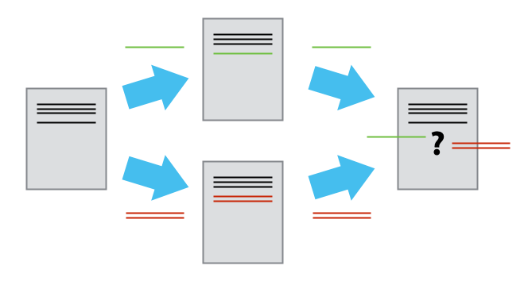

As soon as people can work in parallel, they'll likely step on each other's
toes.  This will even happen with a single person: if we are working on
a piece of software on both our laptop and a server in the lab, we could make
different changes to each copy.  Version control helps us manage these
[conflicts]({{ page.root }}/reference/#conflicts) by giving us tools to
[resolve]({{ page.root }}/reference/#resolve) overlapping changes.

To see how we can resolve conflicts, we must first create one.  The file
`project.txt` currently looks like this in both partners' copies of our `inflammation`
repository:

~~~
$ cat project.txt
~~~
{: .bash}

~~~
Some initial data analysis to identify how inflammation changes over time after surgery.
Jane is a Data Scientist and Samit is a statistician. We'll need to determine
who is responsible for what in this project.
We may need to bring a third person with Python programming skills into the project.
The third team member needs to be competent in both Python and R. They
also need to be familiar with matplotlib and ggplot

~~~
{: .output}

Let's add a line to one partner's copy only:

~~~
$ nano project.txt
$ cat project.txt
~~~
{: .bash}

~~~
Some initial data analysis to identify how inflammation changes over time after surgery.
Jane is a Data Scientist and Samit is a statistician. We'll need to determine
who is responsible for what in this project.
We may need to bring a third person with Python programming skills into the project.
The third team member needs to be competent in both Python and R. They
also need to be familiar with matplotlib and ggplot
This line added to the collaborator's copy
~~~
{: .output}

and then push the change to GitHub:

~~~
$ git add project.txt
$ git commit -m "Add a line to the collaborator copy"
~~~
{: .bash}

~~~
[main f4915d6] Add a line to the collaborator copy
 1 file changed, 1 insertion(+)
~~~
{: .output}

~~~
$ git push origin main
~~~
{: .bash}

~~~
Counting objects: 3, done.
Delta compression using up to 4 threads.
Compressing objects: 100% (3/3), done.
Writing objects: 100% (3/3), 333 bytes | 333.00 KiB/s, done.
Total 3 (delta 2), reused 0 (delta 0)
remote: Resolving deltas: 100% (2/2), completed with 2 local objects.
To https://github.com/ARCTraining/inflammation.git
   6cc98ec..f4915d6  main -> main
~~~
{: .output}

Now let's have the other partner (the originator)
make a different change to their copy
*without* updating from GitHub:

~~~
$ nano project.txt
$ cat project.txt
~~~
{: .bash}

~~~
Some initial data analysis to identify how inflammation changes over time after surgery.
Jane is a Data Scientist and Samit is a statistician. We'll need to determine
who is responsible for what in this project.
We may need to bring a third person with Python programming skills into the project.
The third team member needs to be competent in both Python and R. They
also need to be familiar with matplotlib and ggplot
Add a different line to the originator's copy
~~~
{: .output}

We can commit the change locally:

~~~
$ git add project.txt
$ git commit -m "Add a line in the originator's copy"
~~~
{: .bash}

~~~
[main ef10d89] Add a line in the originator's copy
 1 file changed, 1 insertion(+)
~~~
{: .output}

but Git won't let us push it to GitHub:

~~~
$ git push origin main
~~~
{: .bash}

~~~
To https://github.com/jane/inflammation.git
 ! [rejected]        main -> main (fetch first)
error: failed to push some refs to 'https://github.com/jane/inflammation.git'
hint: Updates were rejected because the remote contains work that you do
hint: not have locally. This is usually caused by another repository pushing
hint: to the same ref. You may want to first integrate the remote changes
hint: (e.g., 'git pull ...') before pushing again.
hint: See the 'Note about fast-forwards' in 'git push --help' for details.
~~~
{: .output}

Git detects that the changes made in one copy overlap with those made in the other
and stops us from trampling on our previous work.
What we have to do is pull the changes from GitHub,
[merge]({{ page.root }}/reference/#merge) them into the copy we're currently working in,
and then push that.
Let's start by pulling:

~~~
$ git pull origin main
~~~
{: .bash}

~~~
remote: Counting objects: 3, done.
remote: Compressing objects: 100% (1/1), done.
remote: Total 3 (delta 2), reused 3 (delta 2), pack-reused 0
Unpacking objects: 100% (3/3), done.
From https://github.com/jane/inflammation
 * branch            main     -> FETCH_HEAD
   6cc98ec..f4915d6  main     -> origin/main
Auto-merging project.txt
CONFLICT (content): Merge conflict in project.txt
Automatic merge failed; fix conflicts and then commit the result.
~~~
{: .output}

`git pull` tells us there's a conflict,
and marks that conflict in the affected file:

~~~
$ cat project.txt
~~~
{: .bash}

~~~
Some initial data analysis to identify how inflammation changes over time after surgery.
Jane is a Data Scientist and Samit is a statistician. We'll need to determine
who is responsible for what in this project.
We may need to bring a third person with Python programming skills into the project.
The third team member needs to be competent in both Python and R. They
also need to be familiar with matplotlib and ggplot
<<<<<<< HEAD
Add a different line to the originator's copy
=======
This line added to the collaborator's copy
>>>>>>> f4915d64b522b8f4599fa89b7d194e615462f99f
~~~
{: .output}

Our change is preceded by `<<<<<<< HEAD`.
Git has then inserted `=======` as a separator between the conflicting changes
and marked the end of the content downloaded from GitHub with `>>>>>>>`.
(The string of letters and digits after that marker
identifies the commit we've just downloaded.)

It is now up to us to edit this file to remove these markers
and reconcile the changes.
We can do anything we want: keep the change made in the local repository, keep
the change made in the remote repository, write something new to replace both,
or get rid of the change entirely.
Let's replace both so that the file looks like this:

~~~
$ cat project.txt
~~~
{: .bash}

~~~
Some initial data analysis to identify how inflammation changes over time after surgery.
Jane is a Data Scientist and Samit is a statistician. We'll need to determine
who is responsible for what in this project.
We may need to bring a third person with Python programming skills into the project.
The third team member needs to be competent in both Python and R. They
also need to be familiar with matplotlib and ggplot
Add a different line to the originator's copy
This line added to the collaborator's copy

~~~
{: .output}

To finish merging,
we add `project.txt` to the changes being made by the merge
and then commit:

~~~
$ git add project.txt
$ git status
~~~
{: .bash}

~~~
On branch main
All conflicts fixed but you are still merging.
  (use "git commit" to conclude merge)

Changes to be committed:

	modified:   project.txt

~~~
{: .output}

~~~
$ git commit -m "Merge changes from GitHub"
~~~
{: .bash}

~~~
[main 2abf2b1] Merge changes from GitHub
~~~
{: .output}

Now we can push our changes to GitHub:

~~~
$ git push origin main
~~~
{: .bash}

~~~
Counting objects: 7, done.
Delta compression using up to 4 threads.
Compressing objects: 100% (7/7), done.
Writing objects: 100% (7/7), 755 bytes | 755.00 KiB/s, done.
Total 7 (delta 4), reused 0 (delta 0)
remote: Resolving deltas: 100% (4/4), completed with 3 local objects.
To https://github.com/jane/inflammation.git
   f4915d6..dc29981  main -> main
~~~
{: .output}

Git keeps track of what we've merged with what,
so we don't have to fix things by hand again
when the collaborator who made the first change pulls again:

~~~
$ git pull origin main
~~~
{: .bash}

~~~
remote: Counting objects: 7, done.
remote: Compressing objects: 100% (3/3), done.
remote: Total 7 (delta 4), reused 7 (delta 4), pack-reused 0
Unpacking objects: 100% (7/7), done.
From https://github.com/jane/inflammation
 * branch            main     -> FETCH_HEAD
   f4915d6..dc29981  main     -> origin/main
Updating f4915d6..dc29981
Fast-forward
 analysis.txt | 1 +
 1 files changed, 1 insertions(+)
~~~
{: .output}

We get the merged file:

~~~
$ cat project.txt
~~~
{: .bash}

~~~
Some initial data analysis to identify how inflammation changes over time after surgery.
Jane is a Data Scientist and Samit is a statistician. We'll need to determine
who is responsible for what in this project.
We may need to bring a third person with Python programming skills into the project.
The third team member needs to be competent in both Python and R. They
also need to be familiar with matplotlib and ggplot
Add a different line to the originator's copy
This line added to the collaborator's copy
~~~
{: .output}

We **don't** need to merge again because Git knows someone has already done that.

Git's ability to resolve conflicts is very useful, but conflict resolution
costs time and effort, and can introduce errors if conflicts are not resolved
correctly. If you find yourself resolving a lot of conflicts in a project,
consider these technical approaches to reducing them:

- Pull from upstream more frequently, especially before starting new work
- Use topic branches to segregate work, merging to main when complete
- Make smaller more atomic commits
- Where logically appropriate, break large files into smaller ones so that it is
  less likely that two authors will alter the same file simultaneously

Conflicts can also be minimized with project management strategies:

- Clarify who is responsible for what areas with your collaborators
- Discuss what order tasks should be carried out in with your collaborators so
  that tasks expected to change the same lines won't be worked on simultaneously
- If the conflicts are stylistic churn (e.g. tabs vs. spaces), establish a
  project convention that is governing and use code style tools (e.g.
  `htmltidy`, `perltidy`, `rubocop`, etc.) to enforce, if necessary

> ## Solving Conflicts that You Create
>
> Clone the repository created by your instructor.
> Add a new file to it,
> and modify an existing file (your instructor will tell you which one).
> When asked by your instructor,
> pull her changes from the repository to create a conflict,
> then resolve it.
{: .challenge}

> ## Conflicts on Non-textual files
>
> What does Git do
> when there is a conflict in an image or some other non-textual file
> that is stored in version control?
>
> > ## Solution
> >
> > Let's try it. Suppose Jane saves an image of a chart she creates and
> > calls it `chart1.jpg`.
> >
> > If you do not have an image file of a chart somewhere, you can create
> > a dummy binary file like this:
> >
> > ~~~
> > $ head --bytes 1024 /dev/urandom > chart1.jpg
> > $ ls -lh chart1.jpg
> >
> > or on a Mac:
> > $ head -c 1024 /dev/urandom > chart1.jpg
> > $ ls -lh chart1.jpg
> > ~~~
> > {: .bash}
> >
> > ~~~
> > -rw-r--r-- 1 vlad 57095 1.0K Mar  8 20:24 mars.jpg
> > ~~~
> > {: .output}
> >
> > `ls` shows us that this created a 1-kilobyte file. It is full of
> > random bytes read from the special file, `/dev/urandom`.
> >
> > Now, suppose Jane adds `chart1.jpg` to her repository:
> >
> > ~~~
> > $ git add chart1.jpg
> > $ git commit -m "Add a chart image"
> > ~~~
> > {: .bash}
> >
> > ~~~
> > [main c769bc5] Add a chart image
> > 1 file changed, 0 insertions(+), 0 deletions(-)
> > create mode 100644 chart1.jpg
> > ~~~
> > {: .output}
> >
> > Suppose that Jane's collaborator has added a similar picture in the meantime
> > and pushed it up to the Github repository.
> >
> > His is a picture of another chart, but it is *also* called `chart1.jpg`.
> > When Jane tries to push, she gets a familiar message:
> >
> > ~~~
> > $ git push origin main
> > ~~~
> > {: .bash}
> >
> > ~~~
To https://github.com/jane/inflammation.git
 ! [rejected]        main -> main (fetch first)
error: failed to push some refs to 'https://github.com/jane/inflammation.git'
hint: Updates were rejected because the remote contains work that you do
hint: not have locally. This is usually caused by another repository pushing
hint: to the same ref. You may want to first integrate the remote changes
hint: (e.g., 'git pull ...') before pushing again.
hint: See the 'Note about fast-forwards' in 'git push --help' for details.
> > ~~~
> > {: .output}
> >
> > We've learned that we must pull first and resolve any conflicts:
> >
> > ~~~
> > $ git pull origin main
> > ~~~
> > {: .bash}
> >
> > When there is a conflict on an image or other binary file, git prints
> > a message like this:
> >
> > ~~~
> > $ git pull origin main
> > remote: Counting objects: 3, done.
> > remote: Compressing objects: 100% (3/3), done.
> > remote: Total 3 (delta 0), reused 3 (delta 0), pack-reused 0
> > Unpacking objects: 100% (3/3), done.
> > From https://github.com/ARCTraining/inflammation
> >  * branch            main     -> FETCH_HEAD
> >   dc29981..c769bc5  main     -> origin/main
> > warning: Cannot merge binary files: chart1.jpg (HEAD vs. c769bc59aa612198cf77ac01a9e8f8479d7940ea)
> > Auto-merging chart1.jpg
> > CONFLICT (add/add): Merge conflict in chart1.jpg
> > Automatic merge failed; fix conflicts and then commit the result.
> > ~~~
> > {: .output}
> >
> > The conflict message here is mostly the same as it was for `project.txt`, but
> > there is one key additional line:
> >
> > ~~~
> > warning: Cannot merge binary files: chart1.jpg (HEAD vs. c769bc59aa612198cf77ac01a9e8f8479d7940ea)
> > ~~~
> >
> > Git cannot automatically insert conflict markers into an image as it does
> > for text files. So, instead of editing the image file, we must check out
> > the version we want to keep. Then we can add and commit this version.
> >
> > On the key line above, Git has conveniently given us commit identifiers
> > for the two versions of `chart1.jpg`. Our version is `HEAD`, and the collaborator's
> > version is `c769bc5...`. If we want to use our version, we can use
> > `git checkout`:
> >
> > ~~~
> > $ git checkout HEAD chart1.jpg
> > $ git add chart1.jpg
> > $ git commit -m "Use the greyscale image instead of the colour one"
> > ~~~
> > {: .bash}
> >
> > ~~~
> > [main 860c242] Use the greyscale image instead of the colour one
> > ~~~
> > {: .output}
> >
> > If instead we want to use our collaborator's version, we can use `git checkout` with
> > their commit identifier, `c769bc5`:
> >
> > ~~~
> > $ git checkout c769bc5 chart1.jpg
> > $ git add chart1.jpg
> > $ git commit -m "Use the colour image instead of the greyscale one"
> > ~~~
> > {: .bash}
> >
> > ~~~
> > [main da21b34] Use the colour image instead of the greyscale one
> > ~~~
> > {: .output}
> >
> > We can also keep *both* images. The catch is that we cannot keep them
> > under the same name. But, we can check out each version in succession
> > and *rename* it, then add the renamed versions. First, check out each
> > image and rename it:
> >
> > ~~~
> > $ git checkout HEAD chart1.jpg
> > $ git mv chart1.jpg chart1-grey.jpg
> > $ git checkout c769bc5 chart1.jpg
> > $ git mv chart1.jpg chart1-colour.jpg
> > ~~~
> > {: .bash}
> >
> > Then, remove the old `chart1.jpg` (it it is still there) and add the two new files:
> >
> > ~~~
> > $ git rm chart1.jpg
> > $ git add chart1-colour.jpg
> > $ git add chart1-grey.jpg
> > $ git commit -m "Use two images: grey and colour"
> > ~~~
> > {: .bash}
> >
> > ~~~
> >[main 6aa1183] Use two images: grey and colour
> > 2 files changed, 0 insertions(+), 0 deletions(-)
> > create mode 100644 chart1-colour.jpg
> > rename chart1.jpg => chart1-grey.jpg (100%)
> > ~~~
> > {: .output}
> >
> > Now both images are checked into the repository, and `chart1.jpg`
> > no longer exists.
> {: .solution}
{: .challenge}

## Branching

One approach for managing multiple users working on the same code base is to use git's branching feature. 
Branching is a version control concept that means you can create separate lines of development derived from your main line.
This allows you to make changes to the code, adding functionality or making improvements without messing up your original main code.
When working in a team this means you can separate each team members development work allowing them to work on their problem in
isolation. 

Changes in one branch can be brought into another (such as back into the main branch) through merging but by separating work
between branches this merge step becomes a specific end point that we work too at which conflicts are resolved rather than 
continuously managing conflicts when everyone works on the same branch.

To see what branches are available in your local repository you can type `git branch`

~~~
$ git branch
~~~
{: .bash}

~~~
* main
~~~
{: .output}

The `main` branch is created when the repository is initialised. You can create new branches by using the `git branch` command followed by the name of the branch you want to create. Let's create a new `experimental` branch.

~~~
$ git branch experimental
~~~
{: .bash}

~~~
  experimental
* main
~~~
{: .output}

The asterisk symbol indicates which branch we are currently on (or in git-speak which branch we have checked out).

We can switch to a different branch by using the `git checkout` command.

~~~
$ git checkout experimental
$ git branch
~~~
{: .bash}

~~~
Switched to branch 'experimental'

* experimental
  main
~~~
{: .output}

Let's work through the conflict-causing example but this time using branches. Open the `project.txt` file with a text editor and make
some changes whilst we're on the `experimental` branch.

~~~
$ nano project.txt
$ cat project.txt
~~~
{: .bash}

~~~
Some initial data analysis to identify how inflammation changes over time after surgery.
Jane is a Data Scientist and Samit is a statistician. We'll need to determine
who is responsible for what in this project.
We may need to bring a third person with Python programming skills into the project.
The third team member needs to be competent in both Python and R. They
also need to be familiar with matplotlib and ggplot
Add a different line to the originator's copy
This line added to the collaborator's copy
Here we're making some _experimental_ changes
~~~
{: .output}

Let's now commit this change and push this branch up to GitHub

~~~
$ git add project.txt
$ git commit -m 'adding experimental changes'
$ git push -u origin experimental
~~~
{: .bash}

~~~
[experimental c5d6cba] Breaking updates about Pluto
 1 file changed, 1 insertion(+)

Counting objects: 5, done.
Delta compression using up to 4 threads.
Compressing objects: 100% (3/3), done.
Writing objects: 100% (3/3), 307 bytes, done.
Total 3 (delta 2), reused 0 (delta 0)
To https://github.com/jane/inflammation.git
 * [new branch]      experimental -> experimental
~~~
{: .output}

Here we've used `git push -u` to specify the upstream remote repository `origin` and pushes changes from our local branch
`experimental` to a branch called `experimental` on the remote (in the first instance this will create a new branch on the remote).

Let's do a `git status` to check where we are currently on this branch.

~~~
$ git status
~~~
{: .bash}

~~~
On branch experimental
nothing to commit, working directory clean
~~~
{: .output}

Here we can see we're still on the `experimental` branch and that everything is up to date. 
Let's switch back to the `main` branch and check the original version of `project.txt` doesn't include our experimental changes.

~~~
$ git checkout main
~~~
{: .bash}

~~~
Switched to branch 'main'
~~~
{: .output}

~~~
$ cat project.txt
~~~
{: .bash}

~~~
Some initial data analysis to identify how inflammation changes over time after surgery.
Jane is a Data Scientist and Samit is a statistician. We'll need to determine
who is responsible for what in this project.
We may need to bring a third person with Python programming skills into the project.
The third team member needs to be competent in both Python and R. They
also need to be familiar with matplotlib and ggplot
Add a different line to the originator's copy
This line added to the collaborator's copy
~~~
{: .output}

On the `main` branch out `project.txt` file has remained unchanged. This shows the real power of branches, we can 
create experimental copies of our main code without impacting the original code and all within our existing repository!

If we're happy with the changes made in the `experimental` branch we can look at merging them back into the `main` branch. 
We can do this using `git merge` as shown below but we'll look at how we do this through GitHub.

> ## A Typical Work Session
>
> You sit down at your computer to work on a shared project that is tracked in a
> remote Git repository. During your work session, you take the following
> actions, but not in this order:
>
> - *Make changes* by appending the number `100` to a text file `numbers.txt`
> - *Update remote* repository to match the local repository
> - *Celebrate* your success with beer(s)
> - *Update local* repository to match the remote repository
> - *Stage changes* to be committed
> - *Commit changes* to the local repository
>
> In what order should you perform these actions to minimize the chances of
> conflicts? Put the commands above in order in the *action* column of the table
> below. When you have the order right, see if you can write the corresponding
> commands in the *command* column. A few steps are populated to get you
> started.
>
> |order|action . . . . . . . . . . |command . . . . . . . . . . |
> |-----|---------------------------|----------------------------|
> |1    |                           |                            |
> |2    |                           | `echo 100 >> numbers.txt`  |
> |3    |                           |                            |
> |4    |                           |                            |
> |5    |                           |                            |
> |6    | Celebrate!                | `AFK`                      |
>
> > ## Solution
> >
> > |order|action . . . . . . |command . . . . . . . . . . . . . . . . . . . |
> > |-----|-------------------|----------------------------------------------|
> > |1    | Update local      | `git pull origin main`                     |
> > |2    | Make changes      | `echo 100 >> numbers.txt`                    |
> > |3    | Stage changes     | `git add numbers.txt`                        |
> > |4    | Commit changes    | `git commit -m "Add 100 to numbers.txt"`     |
> > |5    | Update remote     | `git push origin main`                     |
> > |6    | Celebrate!        | `AFK`                                        |
> >
> {: .solution}
{: .challenge}
